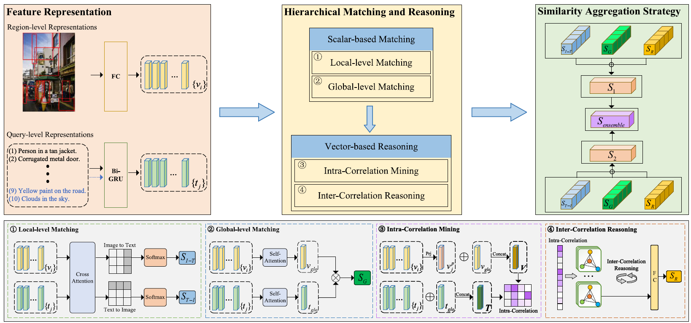

# About Me
Hi! I'm Zhihao, a first-year Ph.D. student in Computer Science at Western University. I'm fortunate to be co-supervised by [Prof. Boyu Wang](https://sites.google.com/site/borriewang/home) and [Prof. Charles Ling](https://www.csd.uwo.ca/~xling/). My research interests include Transfer learning, Trustworthy AI, and Computer Vision. 

Before beginning my Ph.D., I earned my Master's degree from [Tianjin University](https://www.tju.edu.cn/english/index.htm) in 2024, where I focused my research on Cross-Modal Retrieval and Multi-Modal Learning under the guidance of [Prof. Zhong Ji](https://faculty.tju.edu.cn/zhongJi/en/index.htm). Prior to this, I obtained my Bachelor's degree from [Shandong University](https://www.en.sdu.edu.cn) in 2021. 

# News
[2024.02]  Our paper "Hierarchical Matching and Reasoning for Multi-Query Image Retrieval" has been accepted by _Neural Networks_. 

# Selected Publications

    
    

        
[Hierarchical Matching and Reasoning for Multi-Query Image Retrieval]([https://ieeexplore.ieee.org/document/10217826]      (https://www.sciencedirect.com/science/article/abs/pii/S0893608024001242))

Zhong Ji, **Zhihao Li**, Yan Zhang, Haoran Wang, Yanwei Pang, Xuelong Li

    

Neural Networks 2024

[Hierarchical Matching and Reasoning for Multi-Query Image Retrieval]([https://ieeexplore.ieee.org/document/10217826](https://www.sciencedirect.com/science/article/abs/pii/S0893608024001242))

Zhong Ji, **Zhihao Li**, Yan Zhang, Haoran Wang, Yanwei Pang, Xuelong Li

# Academic Services

**Journal Reviewer:**
- IEEE Transactions on Circuits and Systems for Video Technology (TCSVT)
- Knowledge-Based Systems (KBS) 
